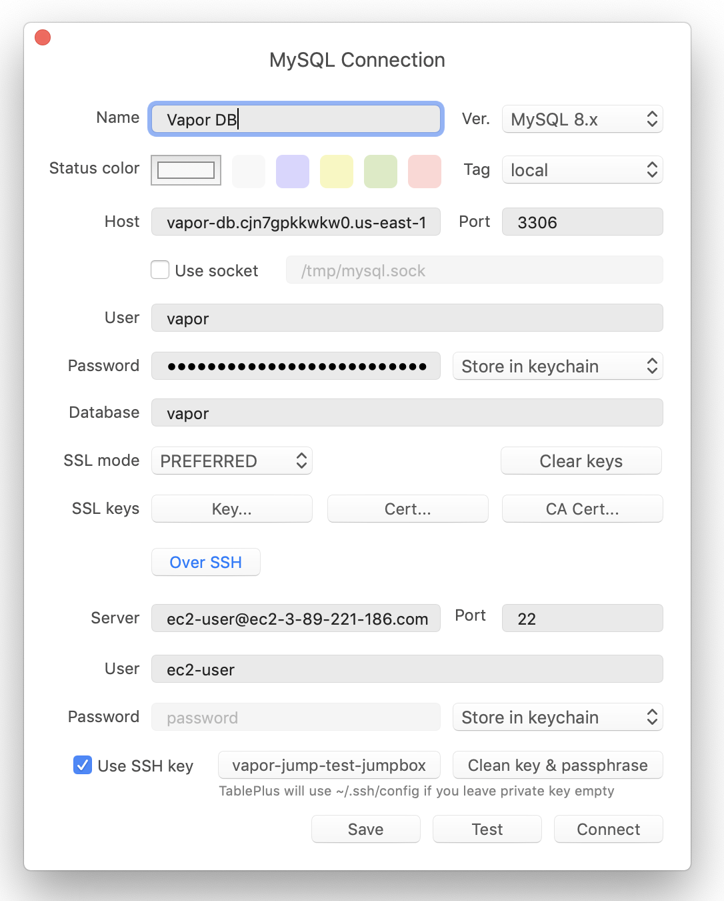

# Databases

[[toc]]

## Introduction

Vapor allows you to easily create and manage RDS and Aurora Serverless databases directly from the Vapor UI or using the Vapor CLI. **Database backups are automatically performed and you may restore a database to any point in time (down to the second) within the backup retention window.**

## Creating Databases

You may create databases using the Vapor UI or using the `database` CLI command. When using the CLI command, the command will prompt you for more details about the database such as its desired performance class and maximum storage space.

```bash
vapor database my-application-db
```

### The Default Database

Vapor will automatically create a "vapor" database within each database instance that you create. You are free to create additional databases using the database management tool of your choice.

### Database Types

When creating Vapor databases, you may choose from two different types of databases: fixed size and auto-scaling serverless databases.

#### Fixed Size Databases

Fixed sized databases are RDS MySQL 8.0 / Postgres 11.0 databases that have a fixed amount of RAM and disk space. These databases may be scaled up or down after creation, but not without incurring downtime.

In addition, these databases may be publicly accessible (with a long, random password automatically assigned by Vapor) or private. Private databases may not typically be accessed from the public Internet. To access them from your local machine, you will need to create a Vapor jumpbox.

:::warning Private Databases

Vapor will place any application that uses a private database in a network with a [NAT Gateway](./networks.md#nat-gateways). Later, if you no longer plan to use the database and are using no other private resources from your application, you may remove the NAT Gateway from your network via the network's management screen.
:::

#### Serverless Databases

Serverless databases are auto-scaling Aurora MySQL 5.6 / Postgres 10.0 databases which do not have a fixed amount of RAM or disk space. Instead, these databases automatically scale based on the needs of your application. At their smallest scale, they are allocated 1GB of RAM.

:::warning Serverless Databases

AWS requires all serverless databases to be private, meaning Vapor will place any application that uses them in a network with a [NAT Gateway](./networks.md#nat-gateways). If you no longer plan to use a serverless database and are using no other private resources from your application, you may remove the NAT Gateway from your network via the network's management screen.
:::

### Quick Development Databases

To quickly create a publicly accessible database of the smallest performance class, you may use the `--dev` flag when creating your database. These small, affordable databases are perfect for testing or staging environments:

```bash
vapor database my-test-database --dev
```

## Using Databases

To attach a database to an environment, add a `database` key to the environment's configuration in your `vapor.yml` file and deploy your application. The value of this key should be the name of the database. **When the environment is deployed, Vapor will automatically inject the necessary Laravel environment variables for connecting to the database, allowing your application to start using it immediately:**

```yaml
id: 3
name: vapor-app
environments:
    production:
        database: my-application-db
        build:
            - 'composer install --no-dev'
        deploy:
            - 'php artisan migrate --force'
```

### Connecting To Private Databases Locally

If you would like to connect to your private database from your local machine, you can either use a Vapor [jumpbox](./networks.md#jumpboxes) in combination with a GUI database management tool or the `database:shell` CLI command. Jumpboxes are very small, SSH accessible servers that are placed within your private network.

#### Jumpboxes + GUI Tool

Once a jumpbox has been created, you may configure your database management tool to connect to your database through the jumpbox SSH connection:



#### Shell Command

After provisioning a jumpbox, you may use the `database:shell` command to quickly access a command line database shell that lets you interact with your database:

```bash
vapor database:shell my-application-db
```

## Database Users

When a database is created, Vapor creates a "vapor" master user. You may create additional database users, which will automatically be assigned a secure, random password, using the Vapor UI or the `database:user` CLI command:

```bash
vapor database:user my-application-db user-2
```

You may instruct an environment to connect to a database as a given user using the `database-user` configuration option within your `vapor.yml` file:

```yaml
id: 3
name: vapor-app
environments:
    production:
        database: my-application-db
        database-user: user-2
        build:
            - 'composer install --no-dev'
        deploy:
            - 'php artisan migrate --force'
```

:::tip Database Password Rotation

You may leverage users to "rotate" the password of a database without downtime by creating a new user, updating the environment to use that user, deploying the environment, and then deleting the old database user.
:::

## Scaling Databases

You may scale fixed size databases via the Vapor UI's database detail screen or the `database:scale` CLI command. When scaling a fixed size database, the database will be unavailable, and the amount of time it takes to scale the database could vary based on the size of the database. Therefore, you should place your application in maintenance mode before beginning the scaling operation:

```bash
vapor database:scale my-application-db
```

## Restoring Databases

Vapor database backups are performed automatically and you may restore databases to any point in time within the database backup retention period, which is currently three days.

When restoring a database, a new database is created with the same configuration as the previous database. Then, the previous database's contents are restored to the new database as they existed at the exact point in time you choose. Once you are satisfied with the database restoration, you may delete the old database.

Database restoration may be initiated via the Vapor UI or the `database:restore` CLI command:

```bash
vapor database:restore current-database-name new-database-name
```

## Metrics

A variety of database performance metrics are available via the Vapor UI's database detail screen or using the `database:metrics` CLI command:

```bash
vapor database:metrics my-application-db
vapor database:metrics my-application-db 5m
vapor database:metrics my-application-db 30m
vapor database:metrics my-application-db 1h
vapor database:metrics my-application-db 8h
vapor database:metrics my-application-db 1d
vapor database:metrics my-application-db 3d
vapor database:metrics my-application-db 7d
vapor database:metrics my-application-db 1M
```

### Alarms

You may configure alarms for all database metrics using the Vapor UI. These alarms will notify you via the notification method of your choice when an alarm's configured threshold is broken and when an alarm recovers.

## Deleting Databases

Databases may be deleted via the Vapor UI or using the `database:delete` CLI command. Once a database has been deleted, it can not be recovered, so take extra caution before deleting a database:

```bash
vapor database:delete my-application-db
```
